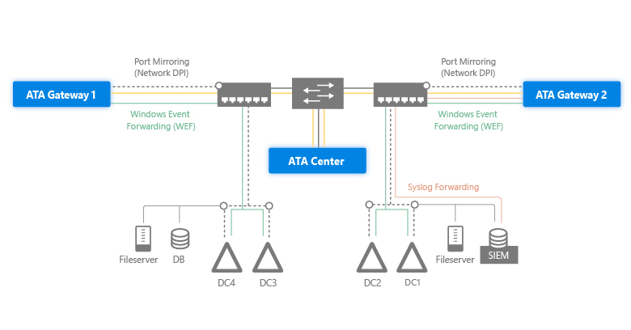
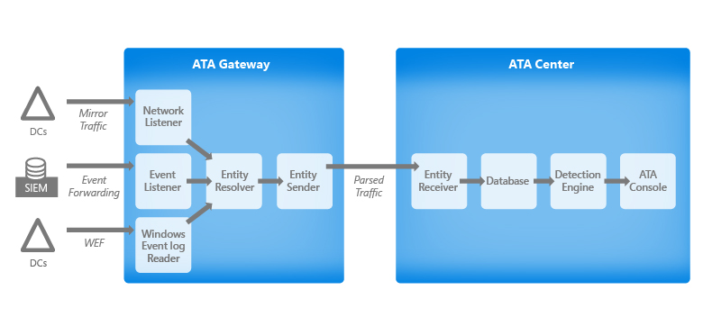

# ATA Architecture
The Advanced Threat Analytics architecture is detailed in this diagram:

ATA has two main components - the ATA Gateway and the ATA Center.

These connect to your existing network by mirroring the network traffic to and from your domain controllers, and by looking at Windows events (forwarded directly from the domain controllers or from a SIEM server) and analyzing the data for attacks and threats.

This section describes the flow of network capturing and processing and drills down into the main components of the ATA Gateway and the ATA Center and their functionality.

## ATA Components
ATA consists of the following:

- One or more ATA Gateways

- One ATA Center

## ATA Gateway
The **ATA Gateway** performs the following functions:

- Captures and inspects domain controller network traffic via port mirroring

- Receives Windows events from SIEM or Syslog servers, or from Domain Controllers using Windows Event Forwarding

- Retrieves data about users and computers from the Active Directory domain

- Performs resolution of network entities (users, groups and computers)

- Transfers relevant data to the ATA Center

- Monitors multiple domain controllers from a single ATA Gateway

The ATA Gateway receives the mirrored network traffic and Windows Events from your network and processes it in the following components:

|||
|-|-|
|Network Listener    |The Network Listener is responsible for capturing network traffic and parsing the traffic. This is a CPU-heavy task, so  it is especially important to check [ATA Prerequisites](../Topic/ATA_Prerequisites.md) when planning your ATA Gateway.    |
|Event Listener    |The Event Listener is responsible for capturing and parsing Windows Events forwarded from a SIEM server on your network.    |
|Windows Event Log Reader    |The Windows Event Log Reader is responsible for reading and parsing Windows Events forwarded to the ATA Gateway's Windows Event Log from the domain controllers.    |
|Entity Resolver    |The Entity Resolver takes the parsed data (network traffic and events) and resolves the data with Active Directory to find account and identity information and match it with the IP addresses found in the parsed data.  Additionally, the Entity Resolver inspects the packet headers efficiently, enables parsing of authentication packets for machine names, properties, and identities and combines it with the data in the actual packet.    |
|Entity Sender    |The Entity Sender is responsible for sending the parsed and matched data to the ATA Center.    |
Consider the following when deciding how many ATA Gateways to deploy on your network:

- Active Directory forests and domains

   ATA Gateways can monitor traffic from multiple domains from a single Active Directory forest.   Monitoring multiple Active Directory forests requires separate ATA Deployments. ATA Gateways should not be configured to monitor network traffic from domain controllers from different forests.

- Port Mirroring

   Port mirroring considerations will require you to deploy at least one ATA Gateway per Active Directory site.

- Capacity

   Each ATA Gateway can parse and send a certain amount of traffic per second. If the domain controllers that you are monitoring are sending and receiving more traffic than the ATA Gateway can handle, you will need to add additional ATA Gateways according to your traffic volume. For more information see [ATA Capacity Planning](../Topic/ATA_Capacity_Planning.md).

## ATA Center
The **ATA Center** performs the following functions:

- Manages ATA Gateway configuration settings

- Receives data from ATA Gateways

- Detects suspicious activities

- Runs various behavioral machine learning engines

- Runs the ATA Console

- Optional: The ATA Center can be configured to send emails and events when a suspicious activity is detected.

The ATA Center receives parsed traffic  from the ATA Gateway, performs profiling, runs deterministic detection and runs machine learning and behavioral algorithms to learn about your network to enable detection of anomalies and warn you of suspicious activities.

|||
|-|-|
|Entity Receiver    |Receives data from the ATA Gateway and uses it for processing and profiling. Then it inserts that data into the database.    |
|Database    |ATA utilizes MongoDB for purposes of storing all the data in the system:    <ul><li>Network activity </li><li>Event activity </li><li>Unique entities </li><li>Suspicious activities </li><li>ATA configuration </li> </ul>|
|Detection Engines    |The Detection Engines run on the parsed traffic and use machine learning algorithms and deterministic rules to find suspicious activities and abnormal user behavior in your network.    |
|ATA Console    |You use the ATA Console to configure ATA and to monitor suspicious activities detected by ATA on your network. The ATA Console is not dependent on the ATA Center service and will run even when the service is stopped, as long as it can communicate with the database.    |
Consider the following when deciding how many ATA Centers to deploy on your network:

- One ATA Center can monitor a single Active Directory forest. If you have more than one Active Directory forest you will need a minimum of one ATA Center per Active Directory forest.

   In large Active Directory deployments, a single ATA Center might not be able to handle all of the traffic of all your domain controllers. In this case, multiple ATA Centers will be required and ATA detections will be less effective. The number of ATA Centers should be dictated by [ATA Capacity Planning](../Topic/ATA_Capacity_Planning.md).

## Your network components
In order to work with ATA, you will need to make very minimal changes to your existing network, but you need to make sure of the following.

### Port mirroring
For ATA to work, you have to enable port mirroring for all of your domain controllers in the Active Directory forest being monitored. ATA will work if some but not all of your domain controllers have port mirroring enabled to ATA, but detection will be less effective.

Set up port mirroring from your domain controllers to the ATA Gateway. While this mirrors all the domain controller network traffic to the ATA Gateway, only a very small percentage of that traffic is then sent, compressed, to the ATA Center for analysis.

Your domain controllers and the ATA Gateways can be physical or virtual, see [Configure Port Mirroring](../Topic/Configure_Port_Mirroring.md) for more information.

### Events
To enhance ATA detection of Pass-the-Hash, ATA needs Windows Event log ID 4776. This can be forwarded to the ATA Gateway in one of two ways, by configuring the ATA Gateway to listen for SIEM events or by using Windows Event Forwarding.

- Configuring the ATA Gateway to listen for SIEM events

   Configure your SIEM to forward specific Windows events to ATA. ATA supports a number of SIEM vendors. For more information, see [Configure Event Collection](../Topic/Configure_Event_Collection.md).

- Configuring Windows Event Forwarding

   Another way ATA can get your events is by configuring your domain controllers to forward Windows event 4776 to your ATA Gateway. This is especially useful if you don't have a SIEM or if your SIEM is not currently supported by ATA. For more information about Windows Event Forwarding in ATA , see [Configuring Windows Event Forwarding](../Topic/Configure_Event_Collection.md#ATA_event_WEF).

## See Also
[ATA Prerequisites](../Topic/ATA_Prerequisites.md)
[ATA Capacity Planning](../Topic/ATA_Capacity_Planning.md)
[Configure Event Collection](../Topic/Configure_Event_Collection.md)
[Configuring Windows Event Forwarding](../Topic/Configure_Event_Collection.md#ATA_event_WEF)
[For support, check out our forum!](https://social.technet.microsoft.com/Forums/security/en-US/home?forum=mata)

