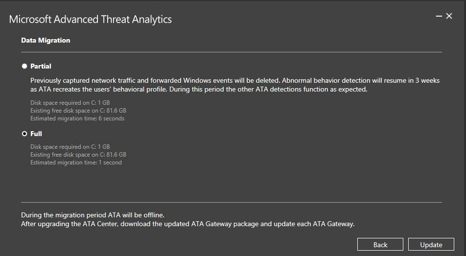
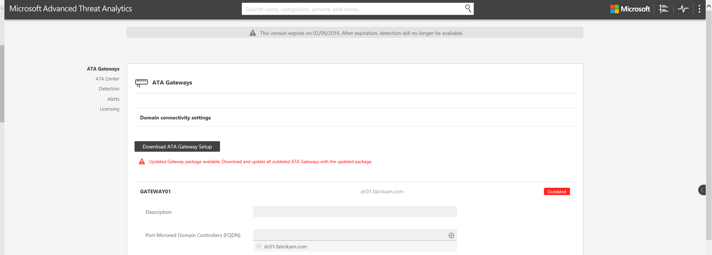
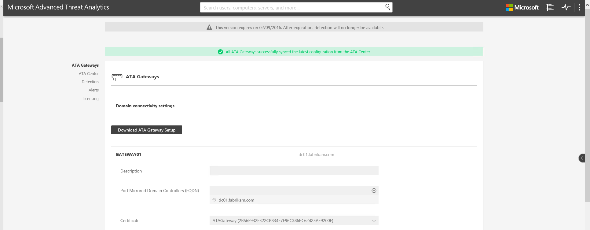

# ATA update to 1.5 migration process
ATA version 1.5 provides improved performance, detection, name resolution and database performance.  New monitoring alerts were added as was support for a single domain controller environment.

If you have never installed ATA, install version 1.5 from scratch by [by installing the update from the Microsoft Advanced Threat Analytics site](http://www.microsoft.com/en-us/evalcenter/evaluate-microsoft-advanced-threat-analytics) and following the standard installation procedure described in [Install ATA](../Topic/Install_ATA.md).

If you already have ATA version 1.4 installed and running, this procedure will walk you through the steps necessary to update your installation.

## Updating ATA to version 1.5
Follow these steps to update to ATA version 1.5:

- Update the ATA Center

- Download the ATA Gateway package

- Update the ATA Gateways

### Step 1: Update the ATA Center

1. On the ATA Center, close your Internet browser.

2. Back up your database: (optional)

   - If the  ATA Center is running as a virtual machine and you want to take a checkpoint, shut the virtual machine down first.

   - If the ATA Center is running on a server, follow the recommended procedure to [back up MongoDB](https://docs.mongodb.org/manual/core/backups/).

3. Run the update file, Microsoft ATA Update, and follow the instructions on the screen to install the update.

   1. In the Welcome page, select your language and click **Next**.

   2. Read the license agreement and if you accept the terms, click the checkbox and click **Next**.

   3. Select whether you want to run the full or partial migration.

      

      - If you select **Partial** migration, any network traffic collected and analyzed by ATA will be deleted and user behavioral profiles will have to be re-learned; this takes a minimum of three weeks. If you are running low on disk space then it is helpful to run a **Partial** migration. It is also faster to run a partial migration, depending on how much network traffic you have had with ATA previously.

      - If you run a **Full** migration, you will need additional disk space, as calculated for you on the upgrade page, and the migration may take longer, depending on how much network traffic you have had with ATA previously. The full migration retains all previously collected data and user behavioral profiles are maintained, meaning that it will not take additional time for ATA to learn behavior profiles and anomalous behavior can be detected  immediately after update.

4. Click **Update**. Once you click Update, ATA is offline until the update procedure is complete.

5. After updating the ATA Center, the ATA Gateways will report that they are now outdated and cannot communicate with the ATA Center.

   

### Step 2: Download the ATA Gateway package

1. Delete any previous versions of the ATA Gateway package.

2. In the ATA Console, download the new ATA Gateway package.

3. Click on the ATA Gateway package folder and select **Properties**

4. On the **Properties** page, **Unblock** the folder and click **Apply**.

### Step 3: Update the ATA Gateways

1. On each ATA Gateway, extract the files from the ATA Gateway package and run the file Microsoft ATA Gateway Setup.

   You can also use this ATA Gateway package to install new ATA Gateways.

2. Your previous settings will be preserved, but it may take a few minutes until for the service to restart.

You will know that all the components of ATA have been successfully updated when all the ATA Gateways report that they are successfully synced.

